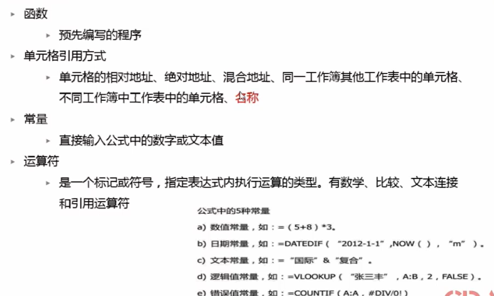
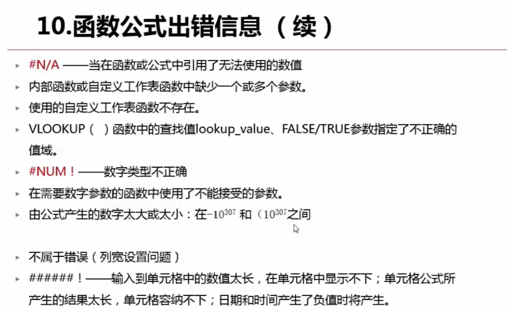
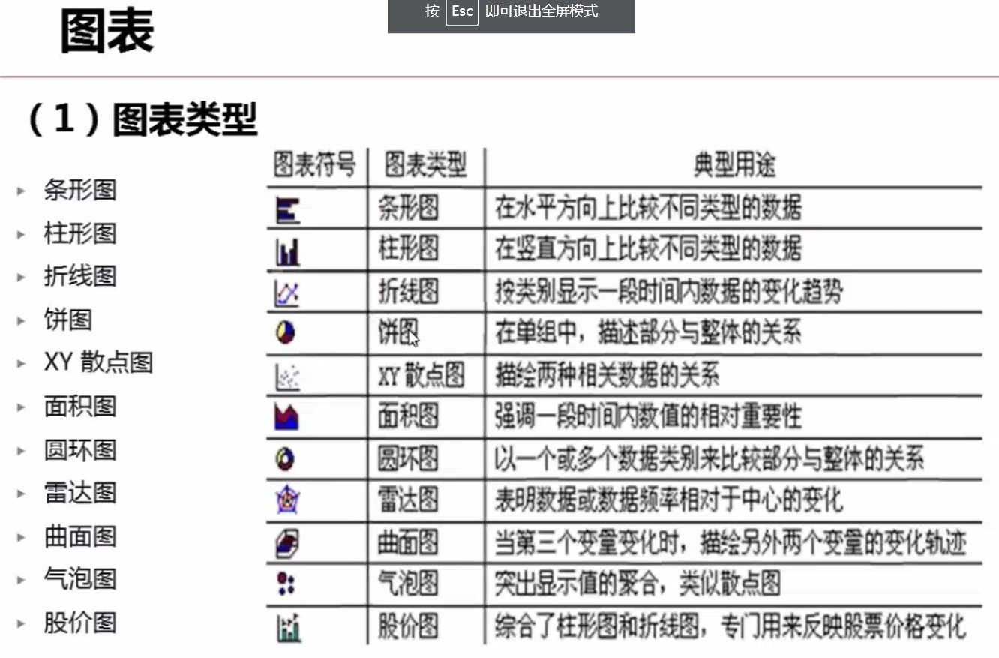

# excel知识点总结

## 基础知识

### 一、快捷键（补充中）

    ctrl + shift + ↓     选中该行向下整列（没有空单元格可以这样选）
    ctrl + shift + →     选中该行向右整列（没有空单元格可以这样选）
    ctrl + shift + →/↓   选中多行多列，按住“ctrl + shift”，然后先后按下→和↓ 。
    ctrl + enter         填充选中第一个单元格填的数字
    alt + =              汇总上方数据，即求上方数据的和（但要求是连续的数据）
    shift + F8           激活添加选定模式，直接选定选择的单元格，选定不连续的单元格
    ctrl + ;             直接在单元格中输入当前日期
    ctrl + 填充炳        直接是等差数列
    Ctrl+Shift+;         可以得到当前时间
　　Ctrl+; 空格 Ctrl+Shift+;     既有日期，又有时间
    F4                          有表格时，切换锁定格式
    shift + enter         打开选中的excel文件
    shift + 鼠标点击      选择多个文档
    ctrl + E              记忆功能，选中单元格之后填充

## 函数

    now()               显示当前时间
    rand()              生成随机数
    int()               取整
    trim()              取消掉所有空单元格
    and()
    if()
    or()
    today()
    sumproduct()       相加相乘
    countif()          条件计数
    offset()            显示偏移单元格的内容
    match()             

### 二、常用方法

     学会使用“常规”这个选项，可以自定义一些高级设置
     “信息”中查看的是该表格的信息，也可以修改一些基本的信息

     excel数据类型：文本，数值，逻辑值，错误值

     对话框启动器（每个菜单斜向右下的45度箭头），用于设置每个单元格的格式（这个很重要，并且很常用）

     公式：公式计算位于核心地位，主要是建立数据之间的关联，然后计算
     公式的组成部分：函数，引用，常量，运算符
     引用：相对引用，绝对引用，混合引用

     公式中数据的颜色就是单元格的颜色，这样便于区分
    
    错误信息：
 
  

  图表类型
    

### 三、基本技巧

    1.使用定位条件方法选择特定条件区域
    选中空单元格
    填充单元格
    选特定格式的单元格
    选中可见单元格
    选中错误单元格，再公式选项中    

    2.使用查找方法选中特定格式区域

    3.选择性粘贴
    乘以一个特定的数字
    更改格式，将文本转换为数字格式，乘以一个数字即可
    合并数据，选择跳过空单元格
    将文本型数字转换为数值型数据有六种方法：
    *1 /1 +0 -0 减负运算 =VALUE(单元格)，用六个公式之一转换，若结果没有变化，将其单元格格式设置为常规

    4.查找和替换从单元格获取格式
    查找和替换时要注意是否需要单元格匹配

    5.辅助列
    生成一串数据，然后通过排序实现差入空行
    每行下加一个空行
    工资条的做法

    6.填充柄的使用
    会模仿你最近做过的操作，然后再填充到你选定的单元格，条件就是数据之间一定要连续
    生成等差数列
    批量复制

    7.设置每页打印标题行
    页面布局->页面设置中->工作表中设置

    8.保护某个单元格不能被修改或者编辑
    在审阅设置中
    注意保护工作表和保护工作簿的区别，保护工作簿包括这个页面下所有的表的数量已成定局，不能增删改查，保护工作表就是单张工作表中不能再增删改查数据，要设置某些单元格不能被编辑，需要再“开始->对齐”的对话框启动器中找到保护即可，但要注意要同时开启工作表保护

    9.冻结首行
    就是在表格向下滑动时第一行置顶，不会消失
    在视图->冻结窗格中设置
    拆分和冻结，都是在视图菜单中选择，拆分能增加表格的可读性，拆分的位置之你所在的单元格的左上角的坐标

    10.开启单元格的下拉列表
    在“数据”菜单中，然后开启“数据验证”即可，可以在“公式”中定义一个你要选择的变量的内容，然后保存即可

    11.将多列存储为下拉列表
    首先选中一列，在“公式”中的定义名称中将它设为一个名字，然后在“数据”菜单中将单元格设为数据验证，选中，设置为序列，然后来源输入“=刚才设置的名称”，然后再回到公式菜单，选中名字，编辑，然后再选中所有选择的多列，这样，就可以实现多列作为下拉列表了，顺序不能搞错

    12.调整每个单元格的行宽和列宽
    选中多行或者多列单元格，然后调整其中的一个单元格的列宽或者行宽之后，其他所有的列宽或者行宽都会变得相同了（变化原则，你选的线跟左边的线（列宽）和上边的线（行宽）的距离就是将要变化的距离。

    13.单元格的时间格式设置为时分秒
    设置日期格式就在
    选中这一列——右键 单元格设置——数字——自定义——类型输入：yyyy-mm-dd hh:mm:ss——确定。

    14.每张表设置属于自己的颜色名字
    右键单击要更改的表即可

    15.快速输入数据
    a.利用自定义列表
    在“文件->选项->高级->编辑自定义列表”，可以自己添加序列，里边有默认序列
    b.填充柄
    文字加数字快速填充，有多个数据，在最右边的数字上加1，Excel可以自己识别；
    等差数列的填充法，输入两个数，选中之后使用填充柄，
    c.填充柄+快捷菜单
    （此处要注意数据的真面目要在编辑栏中看，单元格中显示的是格式化的数据）
    还有一种是输入初始值，然后，右键拖动填充柄，松开之后有选项，可以选择你所需要的数列
    d.多个不连续单元格数据
    选中之后，填入数据，然后“Ctrl + Enter” 填充即可 
    e.文本记忆式输入法
    右键所要输入的单元格，找到从下拉列表中选择即可选择你之前输入过的东西
    f.数据验证输入
    可以粘贴格式，开启验证即可
    g.数据自定义格式
    [=0]"男";[=1]"女"，表示的含义就是输入0的时候显示男，输入1的时候显示女
    h.函数输入
    用=INT(10+90*RAND())，在单元格中显示公式的话在前边加上一个单引号就可以正常显示公式
    i.同时填充多个工作表
    选中相同的几个工作表，然后编辑器中的一张，其他的也会相应的改变，及三张工作表都一样

    16.导入外部的数据
    在“数据”中选择你所要导入的源文件，然后经过一些设置之后就可以完美导入excel

    17.数据分列
    在“数据中找到即可”，然后可以自己设置，找到自己需要的设置即可
    也可以自己找到规律，然后在一个单元格中输入数据，然后快速填充就可以实现，可以提炼数据，或者提炼一些关键字等等
    可以有固定宽度课分隔符，如果没有分隔符的时候，可以利用word替换字符，然后在进行分隔。
    如果想把列转换为行，可以直接转置就可以了（转置操作：先选中要转置的内容，然后Ctrl + C , 然后找到一个位置，然后再粘贴选项中选择转置即可）

    18.自定义数据格式
    数字格式最多可包含四个代码部分，各个部分用分号分隔。这些代码部分按先后顺序定义正数、负数、零值和文本的格式。
    第一种：
    “0”是数字占位符，后跟半角（英文的）双引号引注内容就可以实现
    “@”是文本占位符，后跟半角（英文的）双引号引注内容就可以实现
    想要实现加上固定的某个单元格时，在单元格的作表行和坐标列前加上“$”即可，比如，"H1"要变为“$H$1”就可以固定了
    第二种：
    需要知道Excel数据格式结构：正数，负数，0，文本
    0.0%;[红色](0.0%);[蓝色]0.0         表示正数正常色，负数红色，0蓝色
    [=0]"男";[=1]"女"                   表示输入“0”表示“男”，输入“1”显示“女”
    [=0]"✔";[=1]"✘"                   表示输入“0”表示“✔”，输入“1”显示“✘”

    18.取消大区域的单引号
    方法：
    格式刷复制-一个空单元格。
    复制到这个区域即可。

    19.九九乘法口诀表
    首先建立横向和列项的一到九，然后输入公式即可
    =IF(L$55>$K56,"",L$55&"x"&$K56&"="&$L$55*$K56)

    20.快速将多列数据变为一列，快速将一列数据变成多列
    利用的就是“引用的功能”，需要注意的是，引用之后，如果被引用的值变化，相应的值也会变化，所以，在改变引用的值之前，需要用选择性粘贴将单元格中的内容固定
    需要注意的是，变成多行时，需要把所有的行全部选中，然后把生成的数据选择性粘贴，再把多余的数据删除即可，选择性粘贴的原因就是因为这些单元的内容都是引用的，直接删除之后会导致其他的单元格引用不正常。

    21.设置文字的横向排版或者竖向排版
    在“开始->对齐方式->方向”中设置即可。

    22.跨工作表/工作簿计算
    “！”的使用
    实际上都是之际选中就可以了
    在“公式”中找到

    23.追踪引用单元格
    就是找到这个单元格的内容引自哪里
    这个不能保存，只能临时查看

    25.追踪错误原因
    在“数据”中圈出无效数据，就是因为填完数字之后才开启的数据验证，会导致数据一直保留，点击“圈出无效数据”就会在无效的数据上画红色的圈。

    26.公式求值
    第一种：公式选项卡中的公式求值
    第二种：F9键

    27.将一列的东西合并在一个单元格中
    =A111&B111
    简单来说，就是用了公式迭代，从而达到目的。

    28.判断成绩是否合格
    使用“if()”函数和and()函数的组合
    对四种问题进行判断，需要三个if()函数来判断

    29.统计迟到次数
    使用countif()函数，countif()函数的使用，前面是范围，后边参数是条件。

    30.统计区间
    使用两个countif()函数的差，或者使用countifs()函数，countifs()函数的参数是成对出现的，奇数个是范围，偶数个是筛选条件，要注意，条件参数输入时需要加上双引号。

    31.单元格默认是没有外边框线的，所以填充颜色时都没有边框线，可以设置出现边框线。

    32.菜单栏出现开发工具选项
    “文件->选项->自定义功能区->主选项卡->开发工具->打上对勾”即可实现。

    33.怎样选中指定的单元格
    在左上角的名称框中输入单元格地址或者多个单元格地址，然后就可以直接选中。

    34.设置显示行列标
    在“页面布局->查看”中可以看到。同时也可以选择是否显示网格线。

    35.Excel2016，表格里每隔几行的虚线怎么去掉？
    这个虚线实际上是分页符，就是横向的分页符，可以在“文件->选项->高级->此工作表的显示选项->显示分页符”的复选框去掉即可。

    36.Excel给汉字加拼音
    在“开始中”
