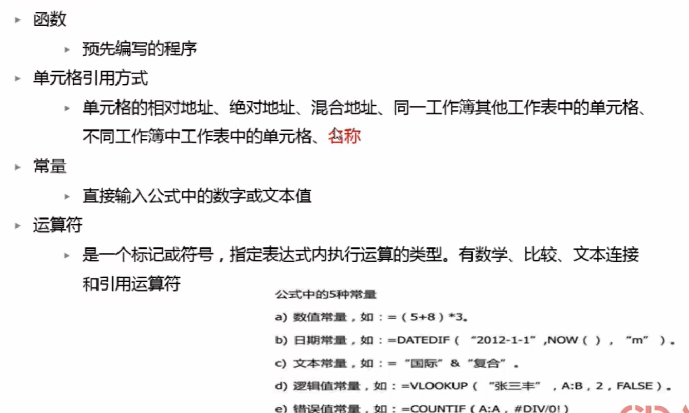
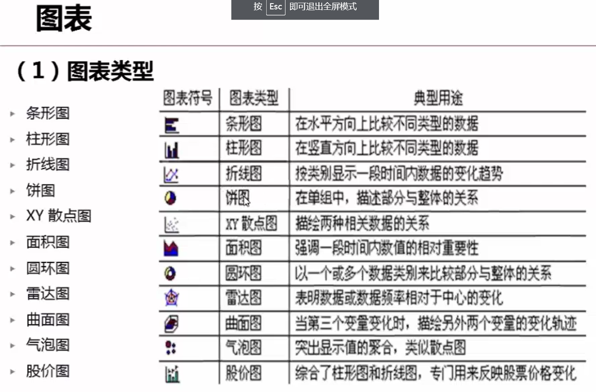

# EXCEL数据分析（分析、公式、函数、可视化）

## 目录

[第一节](#第一节-excel数据分析概述)

[第二节](#第二节-excel数据处理技巧)

[第三节](#第三节-excel数据收集与整合)

[第四节](#第四节-excel公式介绍)

[第五节](#第五节-excel常用函数)

## 常用的重点

[函数](#jump)

## 第一节 Excel数据分析概述

    工作表，工作簿的概念，从第二行“ctrl + shift + ↓”     选中该行向下整列（没有空单元格可以这样选），并且跳转到最后一列，行也是同理；
    “文件->选项”中各种功能的使用，“文件->信息”中详细信息的定义，

    然后还有一些基本的技巧;
    1.使用定位条件方法选择特定条件区域
    选中空单元格
    填充单元格
    选特定格式的单元格
    选中可见单元格
    选中错误单元格，在公式选项中
    ctrl + enter         填充选中第一个单元格填的数字
    还有在隐藏单元格中想要只粘贴可见的单元格，使用定位条件选择可见单元格。
    使用定位条件快速选中错误值

    2.选择性粘贴
    乘以一个特定的数字
    更改格式，将文本转换为数字格式，乘以一个数字即可
    合并数据，选择跳过空单元格
    将文本型数字转换为数值型数据有六种方法：
    *1 /1 +0 -0 减负运算 =VALUE(单元格)，用六个公式之一转换，若结果没有变化，将其单元格格式设置为常规

    3.使用查找方法选中特定格式区域
    查找和替换要记得在下面的单元格中选中所有的单元格
    查找和替换一定要注意是否需要勾选“匹配单元格”的复选框。

## 第二节 Excel数据处理技巧

    1.“Alt + =”          汇总上方的数据和

    2.常用选数据框的组合键
    ctrl + shift + ↓     选中该行向下整列（没有空单元格可以这样选）
    ctrl + shift + →     选中该行向右整列（没有空单元格可以这样选）
    ctrl + shift + →/↓   选中多行多列，按住“ctrl + shift”，然后先后按下→和↓ 。

    3.shift + F8           激活添加选定模式，直接选定选择的单元格，选定不连续的单元格

    4.ctrl + ;             直接在单元格中输入当前日期  
    Ctrl+Shift+;         可以得到当前时间

    6.填充柄的使用
    ctrl + 填充炳        直接是公差为1等差数列
    会模仿你最近做过的操作，然后再填充到你选定的单元格，条件就是数据之间一定要连续，相当于选中单元格之后按下“Ctrl + E”
    生成等差数列
    批量复制

    7.销售额都增加
    在每个数据之下插入空行，这主要用到了排序的思想
    在每个工资条的行面前加入表头，同样用到了排序的思想
    
    8.设置每页打印标题行
    "页面布局->对话框启动器->页面设置中->工作表"中设置,在“左端标题行”选项中选择标题行即可

    9.保护某个单元格不能被修改或者编辑
    在“审阅”设置中：
    注意保护工作表和保护工作簿的区别，保护工作簿包括这个页面下所有的表的数量已成定局，不能增删改查，保护工作表就是单张工作表中不能再增删改查数据；
    要设置某些单元格不能被编辑，需要在对话框启动器中找到“保护”选项，然后将“锁定”复选框取消掉对勾即可，但要注意要同时开启工作表保护，才能让其他的单元格受到保护

    10.冻结首行
    就是在表格向下滑动时第一行置顶，不会消失
    在“视图->冻结窗格->冻结首行”中设置
    拆分和冻结，都是在视图菜单中选择，拆分能增加表格的可读性，拆分的位置之你所在的单元格的左上角的坐标

    11.开启单元格的下拉列表
    在“数据”菜单中，然后开启“数据验证”即可，可以在“公式”中定义一个你要选择的变量的内容，然后保存即可；
    将多列存储为下拉列表：首先选中一列，在“公式”中的定义名称中将它设为一个名字，然后在“数据”菜单中将单元格设为数据验证，选中，设置为序列，然后来源输入“=刚才设置的名称”，然后再回到公式菜单，选中名字，编辑，然后再选中所有选择的多列，这样，就可以实现多列作为下拉列表了，要注意操作顺序不能搞错。

## 第三节 Excel数据收集与整合

    1.快速输入数据
    a.利用自定义列表
    在“文件->选项->高级->编辑自定义列表”，可以自己添加序列，里边有默认序列
    b.填充柄
    文字加数字快速填充，有多个数据，在最右边的数字上加1，Excel可以自己识别；
    等差数列的填充法，输入两个数，选中之后使用填充柄，
    c.填充柄+快捷菜单
    （此处要注意数据的真面目要在编辑栏中看，单元格中显示的是格式化的数据）
    还有一种是输入初始值，然后，右键拖动填充柄，松开之后有选项，可以选择你所需要的数列
    d.多个不连续单元格数据
    选中之后，填入数据，然后“Ctrl + Enter” 填充即可 
    e.文本记忆式输入法
    右键所要输入的单元格，找到从下拉列表中选择即可选择你之前输入过的东西
    f.数据验证输入
    可以粘贴格式，开启验证即可
    g.数据自定义格式
    [=0]"男";[=1]"女"，表示的含义就是输入0的时候显示男，输入1的时候显示女
    h.函数输入
    用=INT(10+90*RAND())，在单元格中显示公式的话在前边加上一个单引号就可以正常显示公式
    i.同时填充多个工作表
    选中相同的几个工作表，然后编辑器中的一张，其他的也会相应的改变，及三张工作表都一样，连续的辅助键shift键，不连续的辅助键ctrl键。
    j.数字格式最多可包含四个代码部分，各个部分用分号分隔。这些代码部分按先后顺序定义正数、负数、零值和文本的格式。
    第一种：
    “0”是数字占位符，后跟半角（英文的）双引号引注内容就可以实现
    “@”是文本占位符，后跟半角（英文的）双引号引注内容就可以实现
    想要实现加上固定的某个单元格时，在单元格的作表行和坐标列前加上“$”即可，比如，"H1"要变为“$H$1”就可以固定了
    第二种：
    需要知道Excel数据格式结构：正数，负数，0，文本
    0.0%;[红色](0.0%);[蓝色]0.0         表示正数正常色，负数红色，0蓝色
    [=0]"男";[=1]"女"                   表示输入“0”表示“男”，输入“1”显示“女”
    [=0]"✔";[=1]"✘"                   表示输入“0”表示“✔”，输入“1”显示“✘”
    详情表：

    2.导入外部的数据
    在“数据”中选择你所要导入的源文件，然后经过一些设置之后就可以完美导入excel

    4.数据分列
    在“数据中找到即可”，然后可以自己设置，找到自己需要的设置即可
    也可以自己找到规律，然后在一个单元格中输入数据，然后快速填充就可以实现，可以提炼数据，或者提炼一些关键字等等
    可以有固定宽度课分隔符，如果没有分隔符的时候，可以利用word替换字符，然后在进行分隔。
    如果想把列转换为行，可以直接转置就可以了（转置操作：先选中要转置的内容，然后Ctrl + C , 然后找到一个位置，然后再粘贴选项中选择转置即可）

    5.文本型数据和数值型数据的转换
    *1， /1，+0，-0， -负数， =VALUE() 

    6.调薪表格式的设计

    7.取消大区域的单引号
    格式刷复制-一个空单元格。
    复制到这个区域即可。

    8.数据分列和分行
    在“数据中找到即可”，然后可以自己设置，找到自己需要的设置即可；
    也可以自己找到规律，然后在一个单元格中输入数据，然后快速填充就可以实现，可以提炼数据，或者提炼一些关键字等等；
    可以有固定宽度课分隔符，如果没有分隔符的时候，可以利用word替换字符，然后在进行分隔；
    如果想把列转换为行，可以直接转置就可以了（转置操作：先选中要转置的内容，然后Ctrl + C , 然后找到一个位置，然后再粘贴选项中选择转置即可）；
    例子：运费分列，一个单元格中的数据分行，转置之后就可以实现分列
    要掌握word的替换和查找功能
    trim()函数的使用

## 第四节 Excel公式介绍

    1.日期分列

    要注意“公式”中计算选项的“自动和手动”的区别。

    调薪求和

    2.乘法口诀表
    首先建立横向和列项的一到九，然后输入公式即可
    =IF(L$55>$K56,"",L$55&"x"&$K56&"="&$L$55*$K56)

    3.本利和
    利用单元格的锁定来做

    5.快速将单列数据转换成多列以及快速将多列数据转换成单列

## 第五节 Excel常用函数

    1.函数错误类型及信息

    2.跨工作表和工作簿的计算

    3.追踪引用单元格
    就是找到这个单元格的内容引自哪里，这个不能保存，只能临时查看，在“公式”选项卡中找到；全出数据的原因就是数据输入之后才设置的数据验证，所以导致数据错误。
    追踪错误原因
    在“数据”中圈出无效数据，就是因为填完数字之后才开启的数据验证，会导致数据一直保留，点击“圈出无效数据”就会在无效的数据上画红色的圈。

    3.用公式合并从而找到数据操作的方法
    如：=A116&B116，就可以把一列数据整合成一个单元格的数据

    4.函数

    5.判断成绩是否合格
    使用“if()”函数和and()函数的组合
    对四种问题进行判断，需要三个if()函数来判断

    6.图表类型

    7.图片背景改变
    
    都在Excel文档中，可以直接打开查看。

## 数据透视表

[学习的链接]（<https://www.bilibili.com/video/BV1St411R7Fy?p=4&spm_id_from=pageDriver>）

### 基本问题

1.数据透视表的及其用途：

可以快速汇总、分析大量数据表格的交互式分析工具，使用数据透视表可以按照数据表格的不同字段从多个角度进行透视，并建立交互表格，用以查看数据表格不同层面的汇总信息、分析结果以及摘要数据。使用数据透视表可以深入的分析数值数据、以帮助用户发现关键数据、并发现并作出有关企业中关键数据的决策。

2.什么时候使用数据透视表：

找出同类数据在不同时期的某种特定关系；

以友好的方式查看大量的数据表格；

对数值数据快速分类汇总按分类和子分类查看数据信息；

建立交叉表格将行移动到列或将列移动到行以查看源数据的不同汇总；

快速的计算数值数据的汇总信息、差异、个体占总体的百分比信息等；

数据源经常变化等等。

### 对数据源的要求

1.每列数据的第一行包含该列的标题；

2.数据源中不能包含空行和空列；

3.数据源中不能包含空单元格；

4.数据源中不能包含合并单元格；

5.数据源中不能包含同类字段（字段就是列的名称）。

看上去既可以作为标题，又可以作为具体数据的内容，这类内容不应该分布在多个列中。

### 基本术语和四大区域

基本术语：
    数据源
    字段
    项

四大区域：
    列区域
    行区域
    值区域：数值类型的自动求和，字符类型的自动计数
    报表筛选区域
