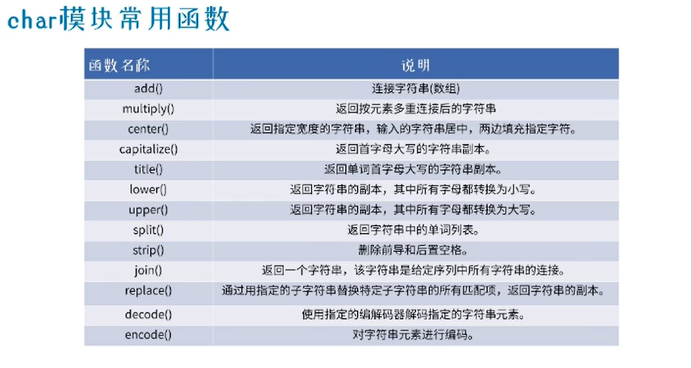

# 学习84节视频完结版笔记

[网站链接]（<https://www.bilibili.com/video/BV1HJ411j7NG?from=search&seid=1975690200769444980>）

## python常用库以及函数

    import numpy as np
    a = np.array([1,2,3])   #创建数组

## python统计分析

### 字符串处理函数

### 实际案例分析
