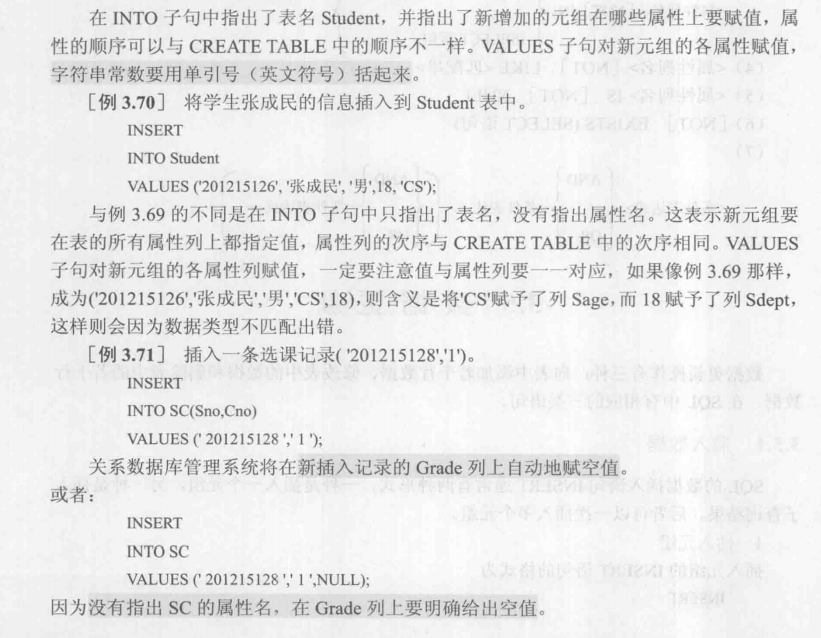
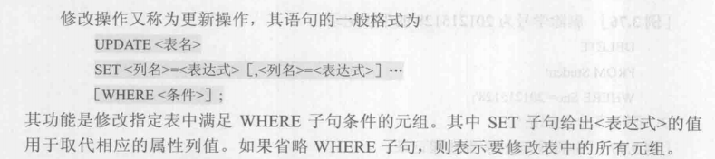

# 数据库系统概述

## 一.SQL概述

### 1.1 四个基本概念

数据：描述事物的符号，数据的含义叫做数据的语义，数据和语义是密不可分的，记录是计算机中表示和存储数据的一种格式或一种方法。

数据库：数据库是存储在计算机内，有组织可共享的大量数据的集合，存储在数据库中的数据按照一定的数据模型描述，组织和存储，具有较小的冗余度，较高的数据独立性和可扩展性，并可被其它用户所共享，简单来说，数据库的三个特点就是永久存储，有组织，可共享

数据库管理系统：数据库管理系统是位于用户和操作系统之间的数据管理软件，他是计算机系统的基础软件，是个复杂庞大软件系统，数据库管理系统的功能主要有：

    数据定义功能
    数据组织，存储和处理功能
    数据操纵功能
    数据库的事务管理和运行管理
    数据库的建立和维护
    其他功能：包括与其他软件的通信功能，不同数据库之间的数据转换功能，异构数据库之间的互访和互操作功能

数据库系统：数据库系统由数据库，数据库管理系统（包括其开发工具），应用程序和数据库管理员组成的对数据进行存储，管理，处理和控制的系统。

数据库系统经历了：人工管理阶段->文件系统阶段->数据库系统阶段，文件系统到数据库系统的过程标志着人们数据管理技术的飞跃

与人工管理和文件系统相比较，数据库系统的特点主要有以下四个方面：

    数据结构化，这也是数据库的主要特征之一，是数据库与文件系统的本质区别；
    数据的共享性高，冗余度低且易扩充；
    数据独立性高；
    数据由数据库管理系统统一控制和管理，这就要求数据库管理系统有以下功能：
        数据的安全性防护
        数据的完整性检查
        并发控制
        数据库恢复

### 1.2 数据模型

数据模型也是一种模型，它是对现实世界数据特征的抽象，也就是说数据模型是用来描述数据，组织数据和对数据进行操作的。

数据模型是对现实世界的模拟，它应该能满足三方面要求：
    一是能比较真实的模拟现实世界；
    二是能被人所理解；
    三是便于在计算机上实现。

数据模型是数据库的核心和基础，数据模型包括概念模型，逻辑模型和物理模型两类，概念模型是按照用户的观点对数据和信息建模，现实世界和信息世界的在中间层次，概念模型的主要方法就是实体-联系方法，也叫做E-R图，逻辑模型包括：

    层次模型
    关系模型
    网状模型
    面向对象数据模型
    对象关系数据模型
    半结构化数据模型

其中，E-R图的设计需要考虑（也就是信息世界的基本概念）：实体，属性，码，实体型，实体集，联系，数据模型的组成要素是数据结构，数据操作和数据的完整性约束

关系模型需要注意的是：关系，元组，属性，码，域，分量和关系模式

关系模型的优缺点：
    优点：
        关系模型与格式化模型不同，它是建立在严格的数学概念基础上的；
        关系模型概念单一，用户比较容易理解；
        关系模型的存取路径对用户是透明的，从而具有更高的数据独立性。
    缺点：
        由于存取路径对用户隐蔽，所以查询效率不高。
数据模型的组成要素：数据结构，数据操作和数据的完整性约束三部分组成

### 1.3 数据库系统的结构

数据模型有“型”和“值”的概念，模式是数据库中全体数据的逻辑结构和特征的描述，是所有用户的公共视图，外模式是用户视图，是数据库用户能够看到和使用的局部数据的逻辑结构和特征的描述。内模式也称为存储模式，一个数据库只有一个内模式，他是数据物理结构和存储方式的描述，是数据在数据库内部的组织方式。

主要是三级模式和两级映像，三级模式的外模式/模式映像保证了数据的逻辑独立性，模式/内模式映像抱枕数据的物理独立性

关系模式是“型”，关系是“值”。

### 1.4 数据库系统的组成

1.硬件平台和数据库
    内存大；
    磁盘大；
    有较高的通道能力，以提高数据传送率。
2.软件
    1.数据库管理系统；
    2.支持数据库管理系统运行的操作系统；
    3.具有与数据库接口的高级语言及其编译系统；
    4.一数据库管理系统为核心的应用开发工具；
    5.为特定应用环境开发的数据库应用系统。
3.人员
    1.数据库管理员；
    2.系统分析员；
    3.数据库设计人员；
    4.应用程序员；
    5.最终用户。

## 二.关系数据库

关系数据库应用数学方法来说处理数据库中的数据

### 2.1 关系数据库结构及形式化定义

关系数据库系统是支持关系数据模型的数据库系统，关系数据库的数据结构只有一种，就是关系，可以简单地理解为一张简单的二维表，关系包含域，笛卡尔积，关系等要素，关系有三种类型:基本表，查询表和视图表，关系的六个基本性质：

    列的数据来自相同的域；
    不同的列的数据也可以来自相同的域；
    行的顺序可以不一样；
    列的顺序可以不一样；
    不同的元组候选码的值一定不能相同；
    分量一定不可再分。

关系模式是型，关系值是值

### 2.2 关系操作

关系操作包括查询和插入，删除，修改两大类，其中，查询包括选择，投影，连接，除，并，差，交，笛卡尔积，其中，选择，投影，并，差，笛卡尔积是5种基本操作

关系数据语言包括关系代数语言（ISBL），关系演算语言，具有关系代数和关系演算双重特点的语言（SQL），其中，关系演算语言又包括元组关系演算语言（ALPHA，QUEL）和域关系演算语言（QBE）。

### 2.3 关系完整性

关系实体完整性
    1.这是针对基本关系而言的，一个基本表只能对应现实世界的一个实体集；
    2.现实世界中的实体是可区分的，即他们都有唯一的标识；
    3.关系模型中以主码作为唯一标识；
    4.主码中的属性不能取空值。

关系参照完整性
    若属性（或属性组）F是基本关系R的外码，它与基本关系S的主码K相对应，则对于R中每个元组在F上的值必须：
    或者取空值；
    或者等于S中的主码值；
    空值；
    非空值，此时必须是另一张表的主码值。

关系用户定义完整性
    是针对某一具体关系数据库的约束条件，它反映某一具体应用所涉及的数据必须满足的语义要求。

### 2.4 关系代数

关系代数是一种抽象的查询语言，他用对关系的运算来表达查询。

传统的集合运算：并，差，交，笛卡尔积。

专门的集合运算：选择，投影，连接，除运算

## 三、关系数据库标准语言SQL

结构化查询语言（Structured Query Language,SQL），是关系数据库的标准语言，也是一个通用的、功能极强的关系数据库语言。

### 3.1 SQL概述

SQL集数据查询、数据操纵、数据定义、和数据定义功能于一体，主要特点有以下：
    1.综合统一
    2.高度非过程化
    3.面向集合的操纵方式
    4.以同一语法结构提供多种使用方式
    5.语言简洁，易学易用

### 3.2 学生-课程数据库

本章主要讲了说明本书的所有语句基于这几张表展开。

### 3.3 数据定义

1.模式的定义与删除；

    create schema/database name;   //创建模式
    drop schema/database name <cascade|restrict>;//删除模式
    删除的时候后边的参数必选其一，cascade表示全部删除，
    而restrict则表示只有该模式下面没有任何表或者视图的时候才能删除。

2.表的定义、修改与删除；

MySQL修改字段的数据类型时使用modify

MySQL修改字段的名称时使用change

在mysql中，可以通过

    “ALTER TABLE 旧表名 RENAME 新表名;”

语句来修改表名，通过

    “ALTER TABLE 表名 CHANGE 旧字段名/列名 新字段名/列名 新数据类型;”

语句来修改列名。

MySQL 中修改表字段名的语法规则如下：

    ALTER TABLE <表名> CHANGE <旧字段名> <新字段名> <新数据类型>;

MySQL 通过 ALTER TABLE 语句来实现表名的修改

CHANGE 也可以只修改数据类型，实现和 MODIFY 同样的效果，方法是将 SQL 语句中的“新字段名”和“旧字段名”设置为相同的名称，只改变“数据类型”。

3.索引的定义、修改与删除

    create [unique] [cluster] index indexname on tablename (colname 次序(,colname 次序));//创建索引
    alter index oldindexname rename to newindexname; //修改索引
    drop index indexname;             //删除索引

4.数据字典

    是关系数据库管理系统内部的一组系统表，它记录了数据库的所有定义信息，
    包括关系模式定义，视图定义，索引定义，完整性定义，各类用户对数据库的操作权限，统计信息等。

### 3.4 数据查询

1.基本查询语句格式

如果有group by子句，则按照它后面的列<列名1>进行分组，该属性列值相等的元组为一个组。通常会在每组中作用聚集函数。如果GROUP BY子句带HAVING短语，则只有满足指定条件的组才予以输出。如果有ORDER BY子句，则结果表还要按<列名2>的值的升序或降序排序。SELECT语句既可以完成简单的单表查询，也可以完成复杂的连接查询和嵌套查询。

2.单表查询

    选择表中的若干列
        查询指定列；
        查询全部列；
        查询经过计算的值；
    选择表中的若干数组
        消除取值重复的行；   //distinct
        查询满足条件的元组；
            比较大小
            确定范围
            确定集合
            字符匹配
            涉及空值的查询
            多重条件查询

    order by 子句
        对查询结果按照一个或多个属性列的升序（asc）或者降序（desc）排列，默认为升序，对于空值，排序时显示的次序由具体系统实现来决定。
        例如按升序排，含空值的元组最 后显示;按降序排，空值的元组则最先显示。各个系统的实现可以不同，只要保持一致就行。

    聚集函数:

需要注意的是：where子句中是不能用聚集函数的，聚集函数只能用于select子句和group by中的having子句中

    group by子句

    GROUP BY子句将查询结果按某一列或多列的值分组，值相等的为一组。
    对查询结果分组的目的是为了细化聚集函数的作用对象。如果未对查询结果分组，聚 集函数将作用于整个查询结果。

    WHERE 子句与HAVING短语的区别在于作用对象不同。
    WHERE子句作用于基本表或视图，从中选择满足条件的元组。HAVING短语作用于组，从中选择满足条件的组

3.连接查询

前面的查询都是针对一个表进行的。若一个查询同时涉及两个以上的表，则称之为连接查询。连接查询是关系数据库中最主要的查询，包括等值连接查询、自然连接查询、非等值连接查询、自身连接查询、外连接查询和复合条件连接查询等。

关系数据库管理系统执行该连接操作的一种可能过程是:首先在表 Student 中找到第 一个元组，然后从头开始扫描SC表，逐一查找与Student第一个元组的Sno相等的SC元组，找到后就将Student中的第一个元组与该元组拼接起来，形成结果表中一个元组。SC全部查找完后，再找Student中第二个元组，然后再从头开始扫描SC，逐一查找满足连接条件的元组，找到后就将Student中的第二个元组与该元组拼接起来，形成结果表中一个元组。重复上述操作，直到Student中的全部元组都处理完毕为止。这就是嵌套循环连接算法的基本思想。
若在等值连接中把目标列中重复的属性列去掉则为自然连接。

    自身链接：一个表与自己连接。

    外连接：简单来说就是左连接或者右连接。

    多表连接：连接操作除了可以是两表连接、一个表与其自身连接外，还可以是两个以上的表进行连接，后者通常称为多表连接。

    多表连接包括内连接，外连接和完全链接其中外连接又包括左连接和右连接。

4.嵌套查询
就是有select这样的完整子句在查询语句中。

    带有EXISTS谓词的子查询
    EXISTS代表存在量词3。带有EXISTS谓词的子查询不返回任何数据，只产生逻辑真值“true”或逻辑假值“false”。

    集合查询
    SELECT语句的查询结果是元组的集合,所以多个SELECT语句的结果可进行集合 操作。集合操作主要包括并操作UNION、交操作INTERSECT和差操作EXCEPT。

    基于派生表的查询
    子查询不仅可以出现在WHERE子句中，还可以出现在FROM子句中，这时子查询生成的临时派生表(derived table)成为主查询的查询对象。

select的格式

聚集函数的格式

where的格式

### 3.5 数据更新

1.插入数据：
insert into table_name[属性列] values(常量1(,常量2，...))
其中，表名称后边的属性列可以不写，但是值后边的参数必须要对应上。

2.修改数据

3.删除数据

### 3.6 空值的处理

1.空值的产生
    表不完整，很多信息没来得及填，或者没数据

2.控制的判断
    用is null 或者is not null 来判断

3.控制的约束条件
属性定义(或者域定义)中有NOT NULL约束条件的不能取空值，加了UNIQUE限制的属性不能取空值，码属性不能取空值。

4.控制的算术运算、逻辑运算和比较运算

### 3.7 视图

视图简单来说就是从基本表中抽象出来的一个虚拟的表，可以在其中进行查询。

建立视图：

删除视图：

查询视图：
查询视图就跟查询基本表一样。

更新视图：
更新视图是指通过视图来插入(INSERT)、删除（DELETE）和修改（UPDATE）数据。由于视图是不实际存储数据的虚表，因此对视图的更新最终要转换为对基本表的更新。像查询视图那样，对视图的更新操作也是通过视图消解，转换为对基本表的更新操作。为防止用户通过视图对数据进行增加、删除、修改时，有意无意地对不属于视图范围内的基本表数据进行操作，可在定义视图时加上WITH CHECK OPTION子句。这样在视图上增、删、改数据时，关系数据库管理系统会检查视图定义中的条件，若不满足条件则拒绝执行该操作。

视图的作用：

    视图能够简化用户的操作；
    视图能够使用户从多个角度看待同一数据；
    视图对重构数据库提供了一定程度的逻辑独立性；
    视图能够对机密数据提供安全防护；
    适当利用视图可以更加清晰的表达查询。

## 四. 数据库安全性

一、安全性概述
数据库的安全性是指保护数据库以防止不合法使用所造成的数据泄露、更改或损坏。系统安全保护措施是否有效是数据库系统的主要技术指标之一。

1、数据库的不安全因素
    1）非授权用户对数据库的恶意存取和破坏
    措施：包括用户身份鉴别、存取控制和视图等技术。
    2）数据库中重要或敏感的数据被泄露
    措施：强制存取控制、数据加密存储和加密传输等。
    3）安全环境的脆弱性
    措施：加强计算机系统的安全性保证，建立完善的可信标准（安全标准）。

2、用户身份鉴别
    用户身份鉴别是数据库管理系统提供的最外层安全保护措施，
    每个用户在系统中都有一个用户标识（由用户名和用户标识号组成），
    用户标识号（UID）在系统的生命周期内是唯一的，
    并且系统内部记录这所有合法用户的标识，
    系统鉴别是指由系统提供一定的方式让用户标识自己的身份或名字。
    用户进入系统时由系统进行核对，通过鉴定后才提供使用数据库管理系统的权限。
    用户身份鉴别的方法：

    静态口令鉴别
    目前常用的鉴别方法，相当于设置用户的密码。
    优缺点：简单，容易被攻击，安全性较低。

    动态口令鉴别
    口令是动态变化的，登陆系统前就会获取新口令，相当于短信验证码或者动态令牌。
    优缺点：增加口令被窃取或破解的难度，安全性相对高一些。

    生物特征鉴别
    采用图像处理和模式识别等技术，相当于指纹识别或者脸部识别。
    优缺点：产生质的飞跃，安全性较高。

    智能卡识别
    智能卡是一种不可复制的硬件，内置集成电路的芯片，具有硬件加密功能。
    实际应用中一般采用个人身份识别码（PIN）和智能卡相结合的方式。

3.授权与收回

授权权限语句：GTANT <权限>[,<权限>]… ON<对象类型><对象名>[,<对象类型><对象名>]…TO<用户>[,<用户>]…[WITH GRANT OPTION];

其语义为:将对指定操作对象的指定操作权限授予指定的用户。发出该GRANT语句的可以是数据库管理员，也可以是该数据库对象创建者(即属主owner)，还可以是已经拥有该权限的用户。接受权限的用户可以是一个或多个具体用户，也可以是PUBLIC，即全体用户。如果指定了WITH GRANT OPTION子句，则获得某种权限的用户还可以把这种权限再授予其他的用户。如果没有指定WITH GRANT OPTION子句，则获得某种权限的用户只能使用该权限，不能传播该权限，SQL标准允许具有WITH GRANT OPTION的用户把相应权限或其子集传递授予其他用 户，但不允许循环授权，即被授权者不能把权限再授回给授权者或其祖先。

收回权限语句：REVOKE <权限>[,<权限>]…ON<对象类型><对象名>[,<对象类型><对象名>]…FROM<用户>[,<用户>…[CASCADE|RESTRICT];

将用户U5的INSERT权限收回的同时，级联(CASCADE)收回了U6和U7的 INSERT权限，否则系统将拒绝执行该命令。因为在例4.6中，U5将对SC表的INSERT权限授予了U6，而U6又将其授予了U7(例4.7)。

注意:这里默认值为CASCADE，有的数据库管理系统默认值为RESTRICT，将 自动执行级联操作。如果U6或U7还从其他用户处获得对SC表的INSERT权限，则他们仍具有此权限，系统只收回直接或间接从U5处获得的权限。

角色：

需要注意的是：角色是权限的集合，可以将权限赋给用户，这样用户就可以获得这个权限
得加上：

    set default role role_name to user;

这样才会在用户的账户中出现这个数据库；

## 五. 数据库完整性

    实体完整性
    参照完整性
    用户定义完整性

触发器：触发器是用户定义在关系表上的一类有事件驱动的特殊过程。

触发器的定义：

触发器说明：

触发器实例：

激活触发器：

删除触发器：

## 数据库的存储过程

### 存储过程的基本概念

存储过程（Stored Procedure）是一种在数据库中存储复杂程序，以便外部程序调用的一种数据库对象。

存储过程是为了完成特定功能的SQL语句集，经编译创建并保存在数据库中，用户可通过指定存储过程的名字并给定参数(需要时)来调用执行。

存储过程思想上很简单，就是数据库 SQL 语言层面的代码封装与重用。

优点

    存储过程可封装，并隐藏复杂的商业逻辑。
    存储过程可以回传值，并可以接受参数。
    存储过程无法使用 SELECT 指令来运行，因为它是子程序，与查看表，数据表或用户定义函数不同。
    存储过程可以用在数据检验，强制实行商业逻辑等。

缺点

    存储过程，往往定制化于特定的数据库上，因为支持的编程语言不同。
    当切换到其他厂商的数据库系统时，需要重写原有的存储过程。
    存储过程的性能调校与撰写，受限于各种数据库系统。

结论：

    存储过程OUT定义的参数不接受全局的值，但存储过程能改变全局的值。

    IN定义的参数能传入到存储过程内部，但不能改变外部的值。

    INOUT类型既能传入值，也能改变外部的值。

实例：
